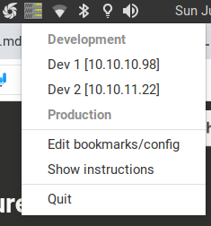
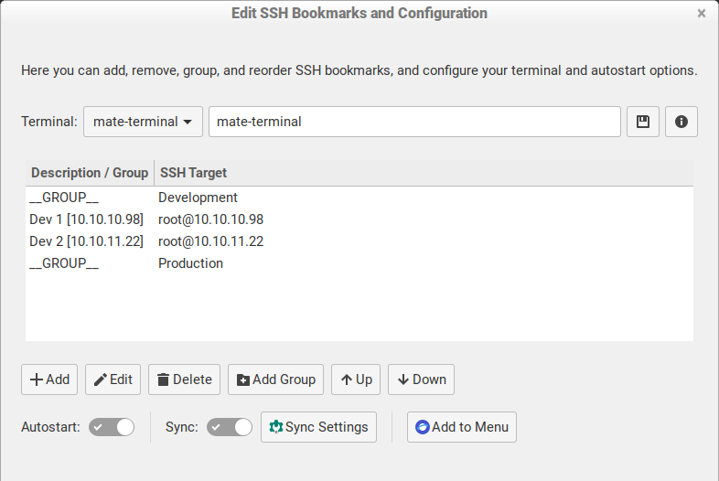
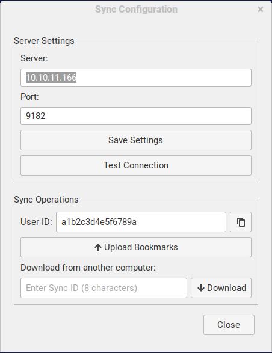

# SSH Bookmark Manager

**One-click SSH access from your system tray** • *Linux desktop app for managing SSH connections*

 


*Right-click the tray icon to see all your servers organized by groups - click any bookmark to connect instantly*

---

## ⚡ Quick Start

**Install:**
```bash
curl -fsSL https://raw.githubusercontent.com/vordan/ssh-tray/main/install.sh | bash
```

**Run:**
```bash
ssh-tray
```

**Use:** Right-click tray icon → Add your servers → Click to connect!


*SSH Bookmark Manager sits quietly in your system tray, ready when you need it*

---

## ✨ Features

- 🖱️ **One-click SSH** from system tray
- 📁 **Group bookmarks** by project/environment  
- 🖥️ **Works with any terminal** (mate, gnome, xfce4, etc.)
- 🔄 **Sync across computers** with your private server
- ⚙️ **Autostart** and desktop integration
- 📝 **Simple text config** files


*Powerful yet simple editor for managing bookmarks, groups, terminal settings, and sync options*

---

## 📋 Requirements

- **Linux** with system tray (Ubuntu, Mint, Fedora, etc.)
- **Python 3.6+** with GTK3 bindings
- **Terminal emulator** (usually pre-installed)

**Install dependencies:**
```bash
# Ubuntu/Debian
sudo apt install python3-gi gir1.2-appindicator3-0.1

# Fedora  
sudo dnf install python3-gobject libappindicator-gtk3-devel
```

---

## 🚀 Usage

### Basic Setup
1. **Start SSH Tray:** `ssh-tray`
2. **Right-click tray icon** → "Edit bookmarks/config"
3. **Add your servers** with the GUI editor
4. **Click any bookmark** to connect instantly


*SSH connections open in new tabs of your preferred terminal with custom titles*

### Bookmark Format
Edit `~/.ssh-bookmarks` directly if you prefer:
```
------ Development ------
Web Server	user@dev.example.com
Database	admin@db.dev.example.com:2222

------ Production ------  
App Server	deploy@prod.example.com
```

### Sync Across Computers
1. **Enable sync** in settings
2. **Upload bookmarks** → get sync ID
3. **On other computer:** Download with sync ID
4. **Done!** Bookmarks synced instantly


*Configure your private sync server and share bookmark configurations across multiple computers*

---

## ⚙️ Configuration

**Terminal:** Edit `~/.ssh-tray-config`
```
terminal=mate-terminal
sync_enabled=true
sync_server=your-server.com
sync_port=9182
```

**Supported terminals:** mate-terminal, gnome-terminal, xfce4-terminal, tilix, konsole, lxterminal, xterm

---

## 🔧 Commands

```bash
ssh-tray                # Start application
ssh-tray --help         # Show help
ssh-tray --version      # Show version  
ssh-tray --uninstall    # Remove application
```

---

## 🗑️ Uninstall

```bash
ssh-tray --uninstall
```
*Offers to backup your bookmarks before removal*

---

## 🛠️ Development

**Run from source:**
```bash
git clone https://github.com/vordan/ssh-tray.git
cd ssh-tray
python3 src/ssh_tray.py
```

**Project structure:**
```
src/ssh_tray/          # Main Python package
├── main.py            # Tray application
├── editor.py          # Bookmark editor
├── sync.py            # Cross-computer sync
└── ...
```

---

## 📞 Support

- **Issues:** [GitHub Issues](https://github.com/vordan/ssh-tray/issues)
- **Email:** vordan@infoproject.biz
- **Company:** Infoproject LLC, North Macedonia

---

## 📄 License

MIT License - see [LICENSE.md](LICENSE.md)

---

**Made with ❤️ for Linux desktop users who love SSH**