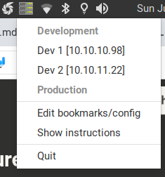
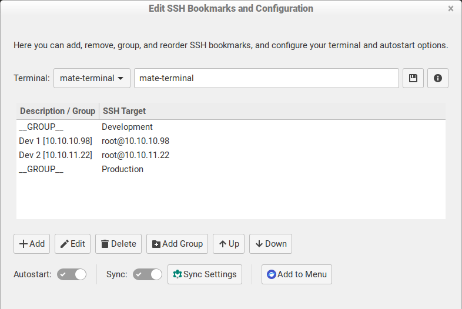
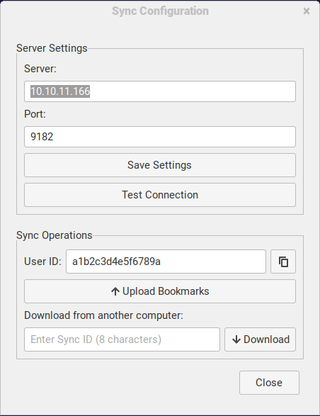

# SSH Bookmark Manager

**One-click SSH access from your system tray** • *Linux desktop app for managing SSH connections*

 



*Right-click the tray icon to see all your servers organized by groups - click any bookmark to connect instantly*

---

## ⚡ Quick Start

**Install:**
```bash
curl -fsSL https://raw.githubusercontent.com/vordan/ssh-tray/main/install.sh | bash
```

**Run:**
```bash
ssh-tray
```

**Use:** Right-click tray icon → Add your servers → Click to connect!


*SSH Bookmark Manager sits quietly in your system tray, ready when you need it*

---

## ✨ Features

- 🖱️ **One-click SSH** from system tray
- 📁 **Group bookmarks** by project/environment
- 🖥️ **Works with any terminal** (mate, gnome, xfce4, etc.)
- 🔄 **Sync across computers** with your private server
- ⚙️ **Autostart** and desktop integration
- 📝 **Simple text config** files


*Powerful yet simple editor for managing bookmarks, groups, terminal settings, and sync options*

---

## 📋 Requirements

- **Linux** with system tray (Ubuntu, Mint, Fedora, etc.)
- **Python 3.6+** with GTK3 bindings
- **Terminal emulator** (usually pre-installed)

**Install dependencies:**
```bash
# Ubuntu/Debian
sudo apt install python3-gi gir1.2-appindicator3-0.1

# Fedora
sudo dnf install python3-gobject libappindicator-gtk3-devel
```

---

## 🚀 Usage

### Basic Setup
1. **Start SSH Tray:** `ssh-tray`
2. **Right-click tray icon** → "Edit bookmarks/config"
3. **Add your servers** with the GUI editor
4. **Click any bookmark** to connect instantly


*SSH connections open in new tabs of your preferred terminal with custom titles*

### Bookmark Format
Edit `~/.ssh-bookmarks` directly if you prefer:
```
------ Development ------
Web Server	user@dev.example.com
Database	admin@db.dev.example.com:2222

------ Production ------
App Server	deploy@prod.example.com
```

### Sync Across Computers
1. **Enable sync** in settings
2. **Upload bookmarks** → get sync ID
3. **On other computer:** Download with sync ID
4. **Done!** Bookmarks synced instantly


*Configure your private sync server and share bookmark configurations across multiple computers*

---

## ⚙️ Configuration

**Terminal:** Edit `~/.ssh-tray-config`
```
terminal=mate-terminal
sync_enabled=true
sync_server=your-server.com
sync_port=9182
```

**Supported terminals:** mate-terminal, gnome-terminal, xfce4-terminal, tilix, konsole, lxterminal, xterm

---

## 🔧 Commands

```bash
ssh-tray                # Start application
ssh-tray --help         # Show help
ssh-tray --version      # Show version
ssh-tray --uninstall    # Remove application
```

---

## 🗑️ Uninstall

```bash
ssh-tray --uninstall
```
*Offers to backup your bookmarks before removal*

---

# Installing OpenSSL 3 on Linux Mint 20.3 (Focal)

This guide resolves the error:
`openssl: error while loading shared libraries: libssl.so.3: cannot open shared object file`

The official repositories for Linux Mint 20.3 (based on Ubuntu 20.04) provide OpenSSL 1.1.1 only.
This guide installs OpenSSL 3 **alongside** the system version without breaking any existing software.

## Compile from Source (Recommended for Focal)

Compiling from source ensures compatibility and places the new libraries in `/usr/local` where they won't interfere with the system's OpenSSL 1.1.1.

### Step 1: Install Build Dependencies
```bash
sudo apt update
sudo apt install build-essential checkinstall zlib1g-dev
```

### Step 2: Download OpenSSL 3 Source
```bash
cd /tmp
wget https://www.openssl.org/source/openssl-3.0.14.tar.gz
tar -xf openssl-3.0.14.tar.gz
cd openssl-3.0.14
```
> **Note:** Check [openssl.org/source](https://www.openssl.org/source/) for the latest version in the 3.0.x LTS series and adjust the filename accordingly.

### Step 3: Configure, Compile, and Install
```bash
./config --prefix=/usr/local/openssl-3 --openssldir=/usr/local/openssl-3 shared zlib
make -j$(nproc)
sudo make install
```

### Step 4: Register the Library with the System
```bash
echo "/usr/local/openssl-3/lib64" | sudo tee /etc/ld.so.conf.d/openssl-3.conf
sudo ldconfig
```

### Step 5: Verify Installation
Check that the library is found:
```bash
ldconfig -p | grep libssl.so.3
```
Expected output should show:
```
libssl.so.3 (libc6,x86-64) => /usr/local/openssl-3/lib64/libssl.so.3
```

Test the OpenSSL binary:
```bash
/usr/local/openssl-3/bin/openssl version
```
Output: `OpenSSL 3.0.14 ...`

### Optional: Create a Convenient Symlink
If you want the `openssl` command to point to version 3 by default:
```bash
sudo ln -sf /usr/local/openssl-3/bin/openssl /usr/local/bin/openssl
```
Now `openssl version` will show 3.x. (The system's original 1.1.1 binary remains at `/usr/bin/openssl`.)

## Uninstalling
To remove OpenSSL 3 completely:
```bash
sudo rm -rf /usr/local/openssl-3
sudo rm /etc/ld.so.conf.d/openssl-3.conf
sudo ldconfig
```

---

# Desktop Entry & Auto-Start Setup (Linux MATE / XFCE / GNOME)

This guide explains how to add a custom application to your system menu and configure it to start automatically on login.

## 📁 1. Create the `.desktop` File

Create a desktop entry in the user's local applications directory:

```bash
nano ~/.local/share/applications/ssh-tray.desktop
```

Paste the following content (adjust `Exec` and `Icon` paths as needed):

```ini
[Desktop Entry]
Name=SSH Tray
Comment=SSH Tray Application
Exec=/usr/local/bin/ssh-tray
Icon=utilities-terminal
Terminal=false
Type=Application
Categories=Network;System;
StartupNotify=false
X-GNOME-Autostart-enabled=true
```

- **Exec**: Full path to your executable.
- **Icon**: You can use a system icon name (like `utilities-terminal`) or a full path to a custom icon file (e.g., `/home/username/.local/share/icons/myapp.png`).
- **Categories**: Determines where the entry appears in the menu.

Save the file (`Ctrl+O`, `Enter`, `Ctrl+X`).

### Refresh the Menu Cache
```bash
update-desktop-database ~/.local/share/applications/
```

The application should now appear in your menu under **Internet** or **System Tools**.

## 🚀 2. Enable Auto-Start on Login

### Option A: Using a Symlink (Recommended)
Create a symlink to the `.desktop` file in the `autostart` directory:

```bash
mkdir -p ~/.config/autostart
ln -s ~/.local/share/applications/ssh-tray.desktop ~/.config/autostart/ssh-tray.desktop
```

### Option B: Using the GUI (MATE)
1. Open **Menu → Preferences → Startup Applications**.
2. Click **Add**.
3. Fill in:
   - **Name:** SSH Tray
   - **Command:** `/usr/local/bin/ssh-tray`
   - **Comment:** (optional)
4. Click **Add** and close the window.

## ✅ 3. Testing

- **Menu Entry:** Search for "SSH Tray" in your application menu and launch it.
- **Auto-Start:** Log out and log back in. The application should start automatically and appear in the system tray.

## 🗑️ Removing the Entry and Auto-Start

To remove the application from the menu and auto-start:

```bash
rm ~/.local/share/applications/ssh-tray.desktop
rm ~/.config/autostart/ssh-tray.desktop
update-desktop-database ~/.local/share/applications/
```


## 🛠️ Development

**Run from source:**
```bash
git clone https://github.com/vordan/ssh-tray.git
cd ssh-tray
python3 src/ssh_tray.py
```

**Project structure:**
```
src/ssh_tray/          # Main Python package
├── main.py            # Tray application
├── editor.py          # Bookmark editor
├── sync.py            # Cross-computer sync
└── ...
```

## 📞 Support

- **Issues:** [GitHub Issues](https://github.com/vordan/ssh-tray/issues)
- **Email:** vordan@infoproject.biz
- **Company:** Infoproject LLC, North Macedonia

## 📄 License

MIT License - see [LICENSE.md](LICENSE.md)

**Made with ❤️ for Linux desktop users who love SSH**
